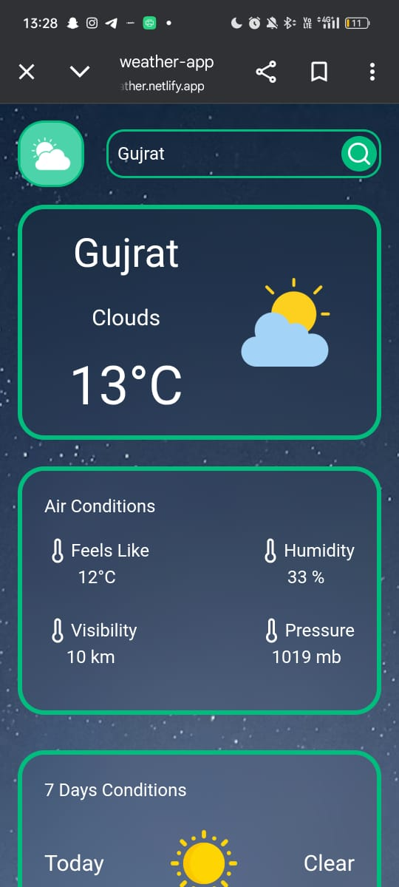
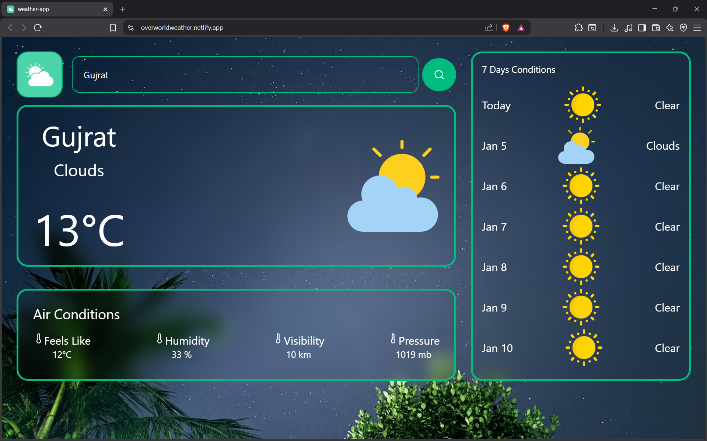

# Weather App 🌤️

A fully responsive **Weather App** built with **React**, **Tailwind CSS**, featuring **current weather** and a **7-day forecast** using the **OpenWeather API**. Weather conditions are visually represented using **lucide-react icons**.  

---

## Features

- 🌍 Search weather for any city  
- ☀️ Display **current weather** including temperature, wind, humidity, and conditions  
- 📅 7-day forecast with daily temperature and conditions  
- 🖼️ Condition icons for better visualization using **lucide-react**  
- 📱 Fully responsive across **mobile, tablet, and desktop**  
- 🔄 Handles missing or unknown conditions gracefully  
- ⚡ Smooth UI with subtle hover effects and clean design  

---

## Screenshots & Demo

| Mobile View | Desktop View |
|-------------|--------------|
|  | 

## Demo Video

▶️ **Mobile Demo (Screen Recording)**  
[Watch Mobile Demo](./public/mobilegif.mp4)

💻 **Desktop Demo (Screen Recording)**  
[Watch Desktop Demo](../../Videos/Captures/Desktop.mp4)


---

## Tech Stack

- **Frontend:** React, Tailwind CSS  
- **Icons:** lucide-react  
- **API Requests:** Axios  
- **API:** OpenWeather API (current weather + 7-day forecast)  
- **Build Tools:** Vite / Create React App  
- **Version Control:** Git + GitHub  

---

## Installation

- Clone the repository:
```bash
git clone https://github.com/himanshuyadav3629/Weather-App.git
cd weather-app
